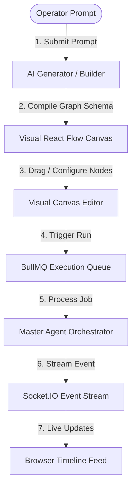
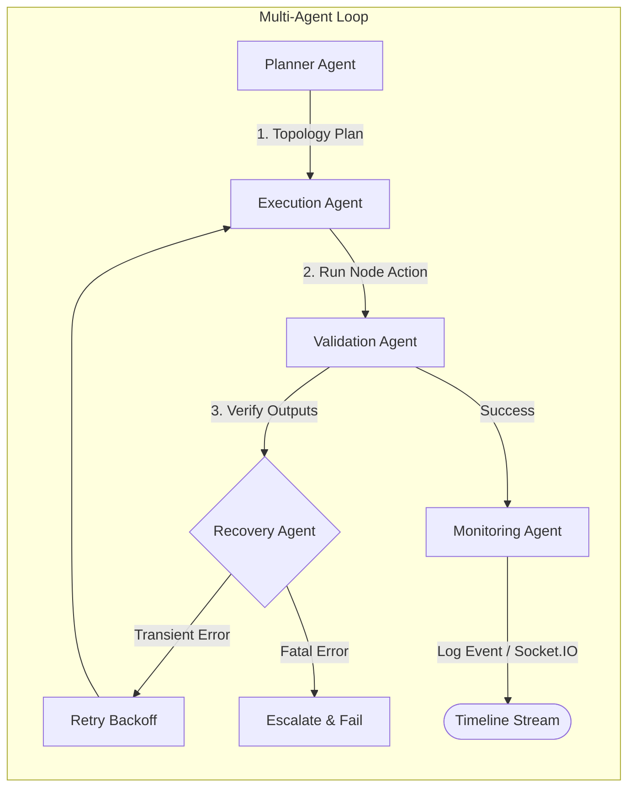

# Agentflow_AI — Agentic AI Automation Platform

### 🚀 Live Deployment Links
* **Frontend Web Console (Live on Vercel)**: [https://client-eight-gules-56.vercel.app](https://client-eight-gules-56.vercel.app)
* **Backend API Gateway Tunnel**: [https://curly-vans-add.loca.lt](https://curly-vans-add.loca.lt)

---
## 🌍 The Problem Agentflow_AI Solves (Real-World Scenarios)
In modern business operations, automation is critical, but current tools fall short:
1. **The Technical Barrier**: Building integrations in tools like Zapier or n8n still requires understanding nodes, schemas, and endpoints, making it slow for non-technical managers.
2. **Fragile Executions**: Traditional automations fail silently or break permanently when third-party APIs rate-limit requests, credentials expire, or payloads change, requiring manual debugging by engineers.
3. **Black-box Orchestration**: Pure AI agents are unpredictable. Operators cannot see, edit, or control the steps the AI takes before it runs.

**Agentflow_AI solves this** by providing a visual, operator-in-the-loop canvas. Operators describe their desired automation in plain English (e.g. *"Append rows to a spreadsheet and post slack updates when an email is received"*). The system compiles this instructions prompt into a structured visual workflow. A multi-agent loop (Planner, Executor, Validator, Recovery, and Monitor) runs the steps sequentially, automatically recovering from transient errors (using exponential retry backoffs), and streaming logs and status alerts to the operator's browser timeline in real-time.

### 📊 System Architecture & Execution Flow


### 🤖 Multi-Agent Orchestration Chain


---

## 🚀 Quick Start Guide

### Prerequisites
* **Node.js** (v18 or higher)
* **MongoDB** (running locally on port `27017` or a MongoDB Atlas URI)
* **Redis** (optional, fallback in-memory queues are active by default)

### Installation
1. Clone the project and navigate to the root directory.
2. Install all dependencies (frontend, backend, and unified root runner) with a single command:
   ```bash
   npm run install-all && npm install
   ```

### Local Dev Server Run (Single Command)
To start both the Next.js client dev server and the Express backend server concurrently in a single terminal:
```bash
npm start
```
* The Next.js frontend will compile and start at `http://localhost:3000`.
* The Express backend will start at `http://localhost:5001` and connect to your local MongoDB database.

---

## 🛠 How to Use the Platform

1. **Sign Up & Log In**: Visit `http://localhost:3000/register` to register your Operator account. Log in to access the Dashboard.
2. **Describe Your Automation (AI Builder)**:
   * Navigate to the **AI Prompt to Graph** builder.
   * Write an instruction (e.g., *"Append a spreadsheet row and post a message to discord"*).
   * Click **Compile AI Flow Graph** to watch the agents generate and position trigger and action nodes.
   * Click **Save to Workspace**.
3. **Refine on Canvas (Visual Editor)**:
   * Modify parameters, drag new trigger/action nodes from the left sidebar palette, draw connector edges, and click **Save Graph** in the toolbar.
4. **Link Integrations**:
   * Navigate to the **Integrations** tab. Click **Establish OAuth** on Gmail or Slack to simulate credentials handshakes and store encrypted tokens.
5. **Execute & Monitor Timeline**:
   * Open a saved workflow on the canvas and click **Execute**.
   * You will be redirected to the **Runs Trace Timeline** page. Watch the Planner Agent sort execution coordinates, the Executor run requests, the Validator verify values, and the Monitor stream chronological events to your feed.
   * Click the **Alert Bell** in the top navigation bar to open the slide-out notifications drawer.

---

# Development Build Progress History

## Phase 1: Project Setup & Authentication
We have successfully initialized the workspace with the dual Next.js/Express architecture and set up a JWT user session flow.

### Backend Setup (`server/`):
- Created a modular Node.js Express server with ES modules support.
- Configured database connectivity in `server/src/config/db.js` with an automated fallback flag to run in-memory when MongoDB is not connected.
- Configured security headers using `helmet`, rate limits using `express-rate-limit`, CORS support, request compression, and Morgan logger.
- Built a Mongoose `User` schema in `server/src/models/User.js` containing name, email, role (`operator` | `admin`), lastLogin time, and a hashed password field (`select: false`).
- Implemented `server/src/services/authService.js` for hashing passwords via bcrypt (cost factor 12) and managing user creation/fetching with support for local array-based fallback operations when database is disconnected.
- Developed authentication middlewares in `server/src/middlewares/authMiddleware.js` for verifying JSON Web Tokens (JWT) and restricting routes to specific user roles.
- Bound auth endpoints (`/api/auth/register`, `/api/auth/login`, `/api/auth/me`) in `server/src/routes/authRoutes.js` and validated request payloads using `express-validator`.
- Scaffolded the initial Socket.IO server setup in `server/src/config/socket.js`.

### Frontend Setup (`client/`):
- Initialized Next.js using the Pages Router with Tailwind CSS, Axios, Zustand state store, and Lucide icons.
- Built a global Zustand authentication store in `client/src/store/authStore.js` to manage session persistence (`localStorage`) and error catching.
- Created `client/src/components/ProtectedRoute` and the main layout shell `client/src/components/AppShell` with dashboard sidebar and slide-out alert drawer.
- Built dashboard metrics panel `client/src/components/MetricGrid` reporting active runs, avg confidence, and recovery statistics.
- Developed pages for:
  - `/` Landing page featuring mock agent sequence and call-to-actions.
  - `/login` and `/register` pages with form validations and loading indicators.
  - `/dashboard` showing recent executions and active telemetry streams.
  - `/settings` showing profile specs and API/encryption key health status.
  - Skeletons for `/workflows`, `/workflows/builder`, `/workflows/[id]`, `/executions`, and `/executions/[id]`.

### Verification:
- Started the backend server (successfully resolved MongoDB local host connection).
- Compiled and launched the Next.js client.
- Executed browser verification flows checking:
  1. Accessibility of landing page.
  2. Submitting registration form.
  3. Proper redirection to dashboard and rendering of stats.
  4. Accessing settings and observing credentials health checks.
  5. Disconnecting/logging out back to the authentication screen.

## Phase 2: Workflow CRUD & Canvas Integration
We have successfully implemented the workflow management backend APIs and built an interactive visual editor canvas using React Flow.

### Backend Setup (`server/`):
- Created the Mongoose schema `server/src/models/Workflow.js` storing name, description, owner, status ('draft', 'active', 'paused', 'archived'), triggerConfig, nodes, edges, version, and tags.
- Implemented `server/src/services/workflowService.js` for handling CRUD operations (create, update, getById, delete, duplicate, list) with automatic fallback storing workflows in memory when MongoDB is disconnected.
- Implemented `server/src/controllers/workflowController.js` mapping workflow REST actions and stubbing workflow triggers.
- Exposed protected REST routes in `server/src/routes/workflowRoutes.js` and mounted them at `/api/workflows` in `server/src/index.js`.

### Frontend Setup (`client/`):
- Developed a Zustand store `client/src/store/workflowStore.js` to manage dashboard states and REST actions.
- Built a draggable node palette component `client/src/components/NodePalette/index.js` containing categorized Trigger, Action, and AI nodes.
- Designed a custom visual node renderer `CustomWorkflowNode` featuring custom brand-specific icons, connection handles, and selection states.
- Integrated React Flow canvas `client/src/components/WorkflowCanvas/index.js` handling layout coordinate drop calculations, interactive edge connections, and save triggers.
- Built a right-hand side panel `client/src/components/NodeConfigPanel/index.js` dynamically adapting input controls to node types (e.g., cron scheduler, gmail text fields, discord webhooks, spreadsheet configs, AI instructions).
- Replaced native `window.prompt` workflow creation with a premium React modal form.
- Designed full listing, searching, duplicating, and deleting tables in the `/workflows` page, linking directly to the visual canvas editor.

## Phase 3: AI Workflow Generation
Developed the AI compiler substrate translating natural language instructions into runnable workflow graphs.

### Backend Setup (`server/`):
- Designed `server/src/services/aiService.js` compiling workflow JSON via OpenRouter models (primary), Google Gemini REST APIs (fallback), or a deterministic rule-based keyword compiler (absolute fallback).
- Added `POST /api/workflows/generate` endpoint returning generated name, description, nodes (sequentially laid out on x-axis), and edges matching canvas specifications.

### Frontend Setup (`client/`):
- Created the `/workflows/builder` page linking text prompt compilation consoles (`PromptInputPanel`), canvas live previewers (`GraphPreviewPanel`), and save actions.

### Verification:
- Cleared caching Turbopack errors by replacing missing trademark brand icons with standard equivalents (`MessageSquare`).
- Executed browser verification scripts compiling visual graphs manually and via AI prompt compiler, verifying coordinates alignment, editing nodes, saving, and duplicating workflows.

## Phase 4: Multi-Agent Execution Engine
Built the multi-agent chronological execution engine implementing distinct roles and modular state persistence.

### Backend Setup (`server/`):
- Created database schemas for tracking executions (`server/src/models/Execution.js`), timeline traces (`server/src/models/ExecutionLog.js`), and agent parameters (`server/src/models/AgentMemory.js`).
- Implemented modular agent scripts in `server/src/agents/` (Planner, Execution, Validation, Recovery, Monitoring) and unified them under the master loop orchestrator `server/src/agents/orchestrator.js`.
- Configured state transition endpoints for starting, pausing, resuming, and cancelling workflow executions, protected under JWT authentication in `server/src/routes/executionRoutes.js`.

### Frontend Setup (`client/`):
- Built dynamic runs tracing lists in `/executions` page displaying color-coded status badges, triggers/retries counters, and run duration gauges.
- Designed chronological agent timelines in `/executions/[id]` displaying live log updates via Socket.IO events, color-coded agent tags, and expandable detail parameters accordions.

## Phase 5: Third-party OAuth Integrations
Constructed the integrations adapter system handling credential encryption and mock OAuth redirections.

### Backend Setup (`server/`):
- Created schema `server/src/models/Integration.js` storing connected third-party configurations.
- Implemented AES-256-CBC token encryption at rest inside `server/src/services/integrationService.js` utilizing the derived application encryption key.
- Created concrete adapters in `server/src/integrations/` extending `BaseIntegration` to invoke Gmail, Slack, Google Sheets, and Discord operations.
- Exposed public OAuth mock routes in `server/src/routes/integrationRoutes.js` implementing a self-healing user ID lookup when the database is connected.

### Frontend Setup (`client/`):
- Created `/integrations` status page displaying active scopes, status toggles, connect links, and disconnect buttons.

## Phase 6: Queues & Socket.IO Real-time Engine
Integrated BullMQ Redis background worker queues, notification channels, and active dashboard components.

### Backend Setup (`server/`):
- Created `server/src/queues/executionQueue.js` wrapping BullMQ queues and workers with automatic Redis connectivity error checking and in-memory asynchronous fallback processing.
- Mounted `/api/notifications` routes in `server/src/index.js` mapping user notification lists and mark-as-read updates.
- Integrated `createNotification` triggers at execution orchestrator milestones (success, warning recovery, and failure escalation).

### Frontend Setup (`client/`):
- Subscribed client layout shell `client/src/components/AppShell` to user-specific real-time notifications via Socket.IO events.
- Created slide-out Alert drawer inside the main AppShell displaying chronological logs and options to mark read individually or collectively.
